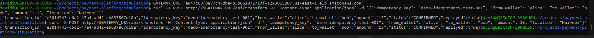
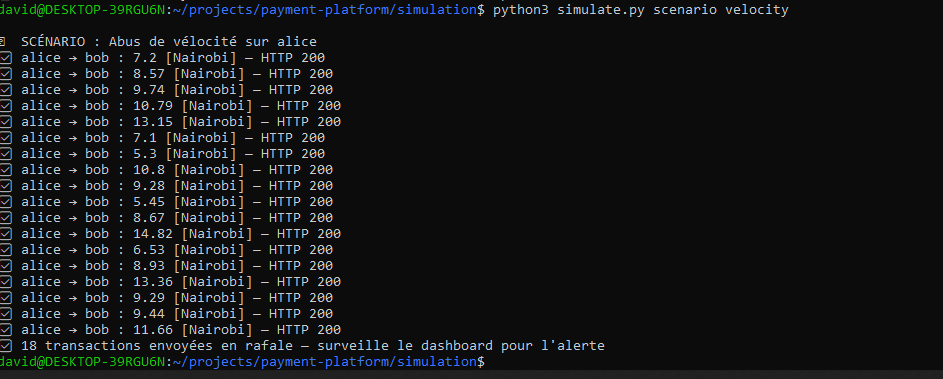
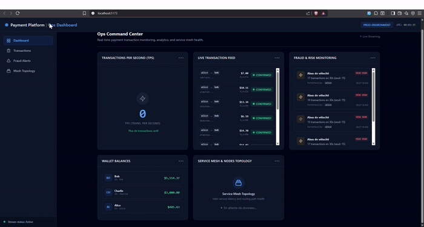
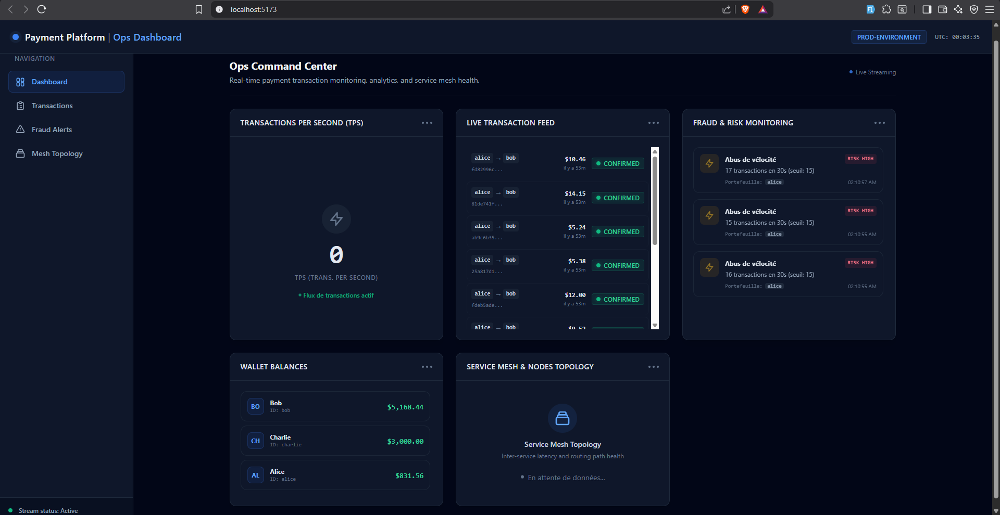
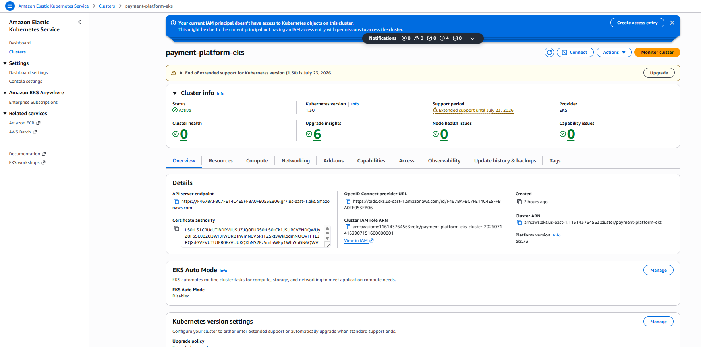
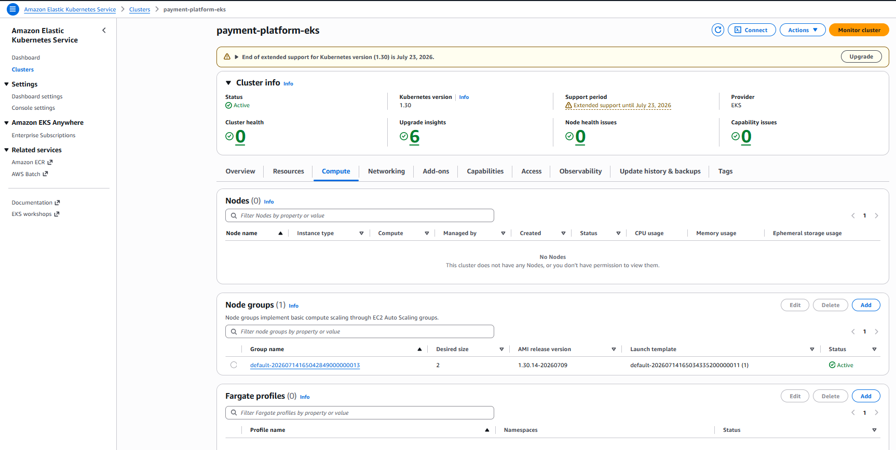
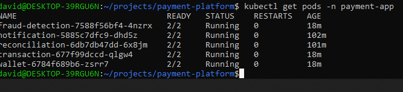
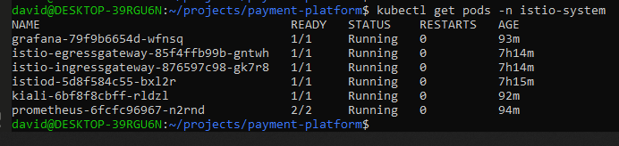
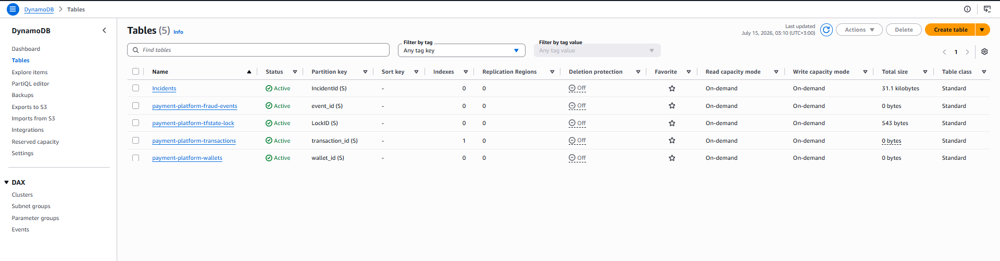
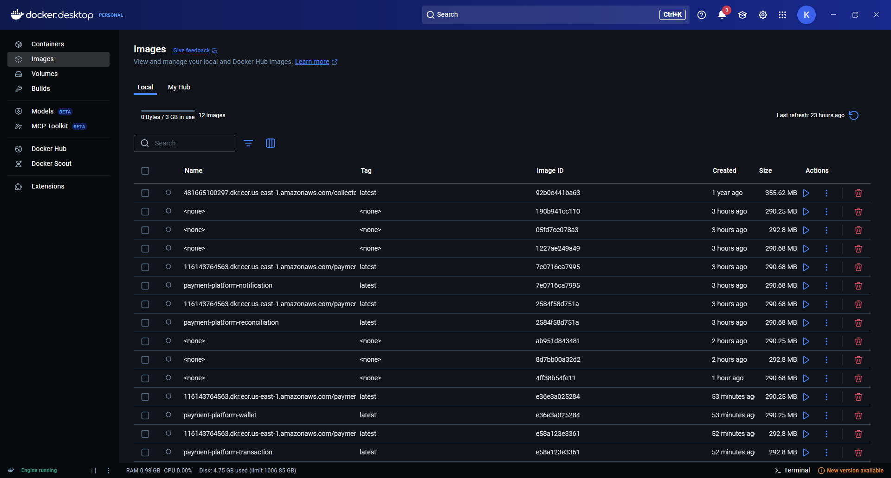

# Payment Platform on EKS

### A resilient, event-driven mobile payment system built on Amazon EKS with Istio, demonstrating exactly-once transaction processing under real network failure conditions

---


**Flow:** A traffic simulator (or the live dashboard) sends requests through an Istio Ingress Gateway on an AWS Network Load Balancer. Requests are routed to one of five microservices running inside the mesh. The Transaction service orchestrates a Saga across Wallet debits and credits, all backed by DynamoDB. A DynamoDB Stream on the Transactions table feeds the Fraud Detection service in near real time. Confirmed transactions and fraud alerts are published to EventBridge, which fans out to SQS queues consumed by the Notification and Reconciliation services.

---

## Table of Contents

- [The Problem This Project Solves](#the-problem-this-project-solves)
- [What This Actually Is](#what-this-actually-is)
- [Tech Stack](#tech-stack)
- [The Build, in Order](#the-build-in-order)
- [Real Problems Hit and Fixed](#real-problems-hit-and-fixed)
- [Proof It Works](#proof-it-works)
- [Cost Discipline](#cost-discipline)
- [Running This Yourself](#running-this-yourself)
- [Architecture Decisions](#architecture-decisions)
- [Cleanup](#cleanup)

---

## The Problem This Project Solves

Mobile money platforms like M-Pesa process millions of transactions a day under one non-negotiable constraint: a transfer must never be lost, and it must never be duplicated, even when the network drops mid-request, a pod crashes, or a client retries the same call three times because it never got a response.

This is one of the hardest problems in distributed systems engineering. Most portfolio projects sidestep it by building a generic CRUD app on top of Kubernetes and calling it "cloud native." This project does the opposite: it picks that one specific, well-understood failure mode and proves, on camera, that it is solved correctly, rather than asserting it in a bullet point.

## What This Actually Is

A 5-microservice payment platform, deployed on a production-pattern Amazon EKS cluster with an Istio service mesh, implementing:

- The **Saga pattern** for distributed transactions (debit, then credit, then confirm, with automatic compensation if any step fails)
- **Idempotency keys** so a retried request returns the original result instead of double-processing money
- **Circuit breaking and mTLS** handled by the mesh, not application code
- **Event-driven decoupling** via EventBridge and SQS, so a slow notification never blocks a transfer
- **Rule-based fraud detection** evaluated within seconds of a transaction being written, via DynamoDB Streams

It was built end to end in a single day: infrastructure, five backend services, a live dashboard, a traffic simulator, and full documentation, then torn down to avoid unnecessary cost.

## Tech Stack

| Layer | Technology |
|---|---|
| Infrastructure as Code | Terraform (remote state in S3, locking via DynamoDB) |
| Orchestration | Amazon EKS (Kubernetes 1.30), 2 AZ, single NAT Gateway |
| Service Mesh | Istio (mTLS, ingress gateway, sidecar injection) |
| Packaging | Helm (one generic chart, parameterized per service) |
| Data | DynamoDB (Wallets, Transactions, FraudEvents) with Streams |
| Events | EventBridge, SQS |
| Security | IAM + IRSA (one role per service, least privilege), Kubernetes namespaces |
| Observability | Prometheus, Grafana, Kiali |
| CI/CD | Docker builds pushed to Amazon ECR |
| Backend services | Python, FastAPI |
| Frontend | React, Vite, Tailwind CSS |
| Simulation | Python traffic generator with three triggerable fraud scenarios |

## The Build, in Order

**1. Local environment.** WSL2 on Windows 11, with a real Hyper-V virtualization issue to debug before anything else could run (see below). Once resolved: AWS CLI, Terraform, kubectl, Helm, istioctl, and Docker Desktop with WSL2 integration.

**2. Terraform backend.** An S3 bucket (versioned, encrypted, public access blocked) and a DynamoDB lock table, bootstrapped with local state before every other module switched to using this backend remotely.

**3. VPC and EKS.** A 2-AZ VPC with a single NAT Gateway (a deliberate time and cost tradeoff, not an oversight), and an EKS cluster with a managed node group of two t3.medium nodes, IRSA enabled from the start.

**4. Istio.** Installed with the demo profile: control plane, ingress gateway, egress gateway.

**5. Data layer.** Three DynamoDB tables, Streams enabled on Transactions, plus an EventBridge bus with rules and two SQS queues as event targets for services that are not Lambdas and therefore need to poll rather than be invoked directly.

**6. Five microservices**, written in FastAPI:
- **Wallet**: atomic debit/credit operations, using DynamoDB conditional expressions so a balance can never go negative, even under concurrent requests.
- **Transaction**: the Saga orchestrator. Checks for an existing idempotency key before doing anything. Debits the sender, credits the receiver, and if the credit step fails, automatically compensates by crediting the sender back. If the compensation itself fails, the transaction is marked `COMPENSATION_FAILED` rather than silently hidden, so a human or the Reconciliation service can catch it.
- **Fraud Detection**: polls the DynamoDB Stream (since this runs as a Kubernetes pod, not a Lambda, it cannot rely on native stream triggers) and evaluates three rules against a sliding in-memory window per wallet: velocity abuse, amount spikes relative to recent history, and impossible travel between two transaction locations too close together in time.
- **Notification**: consumes SQS messages and logs simulated notifications for confirmed transactions and fraud alerts.
- **Reconciliation**: periodically scans total wallet balances to verify the system-wide invariant that money is only ever moved between wallets, never created or destroyed, and tracks event counts from the transaction lifecycle queue.

**7. Docker and ECR.** Five images built and pushed to five ECR repositories, each with a lifecycle policy that keeps only the last five images.

**8. IRSA.** One IAM role per service, each scoped to exactly the DynamoDB tables, EventBridge bus, and SQS queue that service actually needs. Wallet cannot touch FraudEvents. Notification cannot read DynamoDB at all.

**9. Helm.** A single generic chart (`Deployment`, `Service`, `ServiceAccount`) reused across all five services via five separate `values-<service>.yaml` files, rather than five near-duplicate charts.

**10. Istio Gateway.** A `Gateway` and `VirtualService` exposing the API publicly through the AWS load balancer Istio provisions automatically.

**11. Observability.** Prometheus, Grafana, and Kiali installed via Istio's own addon manifests.

**12. Traffic simulator.** A Python script generating continuous Alice-to-Bob traffic and three on-demand fraud scenarios.

**13. Dashboard.** A React operations console polling the live API every 2.5 to 3 seconds, showing a transaction feed, a TPS counter, fraud alerts, and wallet balances.

## Real Problems Hit and Fixed

This section exists because a project that only shows the happy path teaches nothing about engineering judgment. Everything below actually happened during the build.

**WSL2 could not start.** `wsl --install` failed with `HCS_E_HYPERV_NOT_INSTALLED` even after the Windows features were confirmed enabled. The actual cause was that the hypervisor was not set to launch automatically at boot. Fixed with `bcdedit /set hypervisorlaunchtype auto` and a restart.

**Docker Desktop lost its WSL integration after `wsl --shutdown`.** Restarting WSL to apply a group membership change (`usermod -aG docker`) also silently broke the Docker-to-WSL bridge. Cycling the WSL integration toggle in Docker Desktop settings restored it.

**Istio's sidecar injector webhook timed out on every pod creation**, with `ReplicaSet` events showing `context deadline exceeded` calling `istiod`. The Terraform-managed EKS node security group did not, by default, allow the cluster control plane to reach the webhook port (15017) on the worker nodes. Fixed by adding an explicit `node_security_group_additional_rules` ingress rule for that port in the EKS module configuration. Istio was also running a version that officially required a newer Kubernetes minor version than the cluster shipped with, a known compatibility gap that was monitored rather than blocking progress, since it did not affect actual behavior in practice.

**IRSA least-privilege roles were, correctly, too strict at first.** When list endpoints were added after the initial IAM policies were written, DynamoDB `Scan` calls started failing with `AccessDeniedException`, because the original policies only granted `GetItem`, `PutItem`, `UpdateItem`, and `Query`. This was the least-privilege model working exactly as intended: the fix was adding the specific missing permission to the specific role that needed it, not widening access broadly.

**The Istio Gateway route for fraud alerts silently mismatched.** A prefix match on `/api/fraud` combined with a hardcoded rewrite caused `/api/fraud-events` to resolve to a broken path, while the shorter `/api/fraud` worked. Caught by the frontend integration step actually testing the live endpoint rather than assuming the contract, and fixed by aligning the rewrite target with the real route.

**CORS was missing entirely** on the three services called directly from the browser, since none of them originally needed to handle browser requests. Added `CORSMiddleware` to Wallet, Transaction, and Fraud Detection, rebuilt, and redeployed.

## Proof It Works

**Idempotency under retry.** The same request, with the same idempotency key, sent twice:

```bash
curl -X POST http://$GATEWAY_URL/api/transfers \
  -H "Content-Type: application/json" \
  -d '{"idempotency_key": "demo-idempotency-test-001", "from_wallet": "alice", "to_wallet": "bob", "amount": 15, "location": "Nairobi"}'
```

First call returns `"replayed": false`. The exact same call, repeated, returns the same `transaction_id` with `"replayed": true`. Alice was debited once, not twice.



**Fraud detection, live.** Eighteen rapid transfers from the same wallet, generated by the simulator:

```bash
python3 simulate.py scenario velocity
```



The Fraud Detection service picks it up off the DynamoDB Stream within seconds and raises three separate velocity alerts as the threshold is crossed, visible live on the dashboard:



**Live operations dashboard**, polling the real API:



**The cluster, running:**




**All five services and the full Istio/observability stack, healthy:**




**Data layer:**



**Five images, built and pushed to ECR:**



## Cost Discipline

This entire build, from an empty AWS account to a fully working EKS cluster with a live mesh, five microservices, and complete observability, ran against the AWS Free Tier credit for a single account.

**Starting balance:** $120.00
**Balance after the full build, running for the day:** $119.00

The cluster and every associated resource were destroyed the same day (see Cleanup) specifically to keep it that way.

## Running This Yourself

Requirements: AWS CLI, Terraform, kubectl, Helm, istioctl, Docker, an AWS account.

```bash
# 1. Bootstrap the Terraform backend
cd infra/backend
terraform init && terraform apply

# 2. Provision VPC, EKS, ECR, and IRSA roles
cd ../cluster
terraform init && terraform apply

# 3. Provision DynamoDB, EventBridge, and SQS
cd ../data
terraform init && terraform apply

# 4. Connect kubectl
aws eks update-kubeconfig --region us-east-1 --name payment-platform-eks

# 5. Install Istio
istioctl install --set profile=demo -y
kubectl create namespace payment-app
kubectl label namespace payment-app istio-injection=enabled

# 6. Build and push the five service images (repeat per service)
cd services/<service-name>
docker build -t payment-platform-<service-name> .
docker tag payment-platform-<service-name>:latest <ecr-url>/payment-platform-<service-name>:latest
docker push <ecr-url>/payment-platform-<service-name>:latest

# 7. Deploy via Helm (repeat per service)
cd helm
helm install <service-name> ./microservice -f values/values-<service-name>.yaml -n payment-app

# 8. Apply the Istio Gateway
kubectl apply -f infra/istio-config/gateway.yaml

# 9. Install observability addons
kubectl apply -f <istio-dir>/samples/addons/prometheus.yaml
kubectl apply -f <istio-dir>/samples/addons/grafana.yaml
kubectl apply -f <istio-dir>/samples/addons/kiali.yaml

# 10. Run the simulator
cd simulation
pip install -r requirements.txt
python3 simulate.py setup
python3 simulate.py background
```

## Architecture Decisions

**Saga over two-phase commit.** Two-phase commit requires a coordinator and blocks on failure. A Saga trades strict consistency for availability, which is what real payment systems use at scale, and is what this project set out to demonstrate.

**EKS over Lambda for the compute layer.** The explicit goal was to demonstrate Kubernetes and service mesh orchestration. Lambda would have been technically viable for parts of this system but would have diluted that signal.

**Single NAT Gateway, two AZs instead of three.** An explicit time and cost tradeoff for a one-day build, documented here rather than hidden.

**Rule-based fraud detection instead of machine learning.** Transparency mattered more than sophistication for a first version. Every alert traces back to a named, understandable rule, which is itself a legitimate production pattern before investing in a model.

**Stream polling instead of native Lambda triggers.** Because Fraud Detection runs as a long-lived Kubernetes pod rather than a Lambda function, it polls the DynamoDB Stream directly via the Streams API rather than relying on an event-source mapping. This adds a few seconds of latency compared to a native trigger, which is an acceptable tradeoff for this architecture.

## Cleanup

```bash
cd infra/istio-config && kubectl delete -f gateway.yaml
helm uninstall wallet transaction fraud-detection notification reconciliation -n payment-app
cd infra/data && terraform destroy
cd ../cluster && terraform destroy
cd ../backend && terraform destroy
```

Verified against AWS Cost Explorer before and after to confirm no orphaned billable resources remained.
